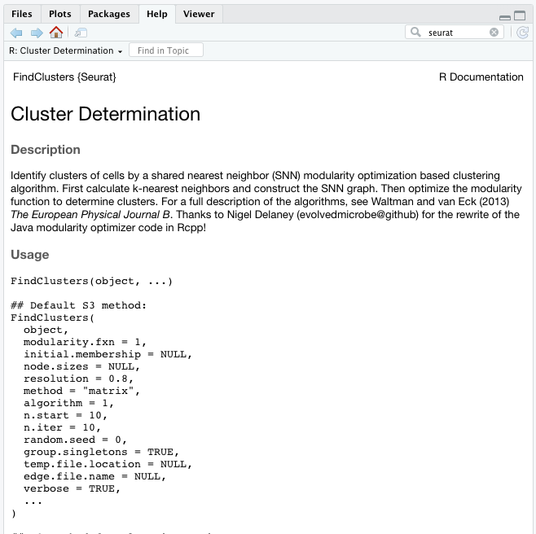
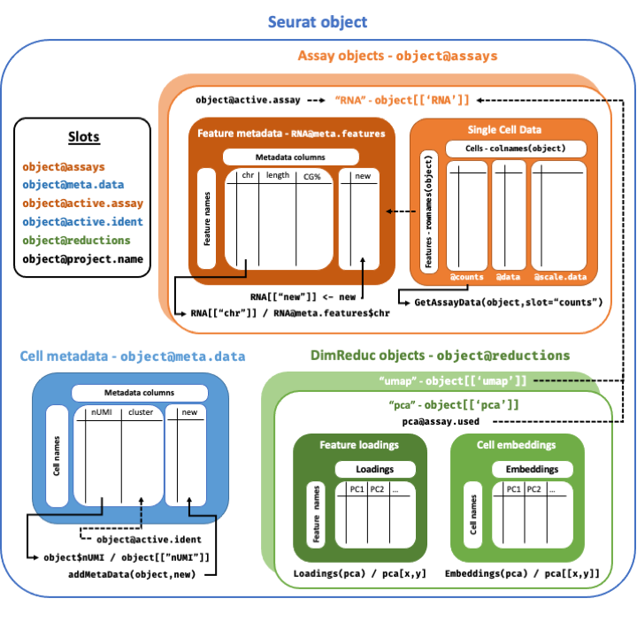

```{r knitr, include = FALSE}
DOCNAME = knitr::current_input()
DOCNAME = gsub(DOCNAME, pattern = ".Rmd", replacement = "")
knitr::opts_chunk$set(autodep        = TRUE,
                      cache          = FALSE,
                      cache.path     = paste0("cache/", DOCNAME, "/"),
                      cache.comments = TRUE,
                      echo           = TRUE,
                      error          = FALSE,
                      fig.align      = "center",
                      fig.path       = paste0("./img/", DOCNAME, "/"),
                      fig.width      = 8,
                      fig.height     = 5,
                      message        = FALSE,
                      warning        = FALSE)
```

**Motivation**
We will use `Seurat` as the main tool for the analysis, where we will also apply some other packages. Seurat has a comprehensive [manual webpage](https://satijalab.org/seurat/) that includes many different tutorials you can use for further practicing. Needed packages for this workshop are loaded with the function `library()`, which will make the tools available for us.

An alternative and well-established tool for `R` users is [scanpy](https://scanpy.readthedocs.io/en/stable/). This is used in the `python` version of this course.

***

**Learning objectives:**

- Get an overview of the `Seurat` package and the `R` language syntax
- Learn and explore the data structure containing a single cell dataset
- Understand and apply basic interactions with the transcript matrix and the components of a dataset

***

**Execution time: 30-60 minutes**

# Setup

```{r message=FALSE}
library(tidyverse)
library(Seurat)
library(SeuratDisk)
library(patchwork)
```

The Seurat functions will help us run all the necessary steps of the analysis from preprocessing, to clustering and visualization. There are also several helper and wrapper functions from other libraries that we will use to run the analysis. Use the `help()` function to see what another function does, and it should appear on the `help tab` 

```{r}
help(FindClusters)
```

```{r, echo = FALSE}

```

# Loading datasets

Data can be loaded from different possible formats, which usually has as a dedicated function for loading. For example, the `Read10X()` function reads in the output of the [cellranger](https://support.10xgenomics.com/single-cell-gene-expression/software/pipelines/latest/what-is-cell-ranger) pipeline from 10X, returning a unique molecular identified (UMI) count matrix. The values in this matrix represent the number of molecules for each feature (i.e. gene; row) that are detected in each cell (column). 

```{r}
sample_2 <- Read10X(data.dir = "/work/Intro_to_scRNAseq_R/data/cellranger_sample2/outs/filtered_feature_bc_matrix/")
sample_3 <- Read10X(data.dir = "/work/Intro_to_scRNAseq_R/data/cellranger_sample3/outs/filtered_feature_bc_matrix/")
```

We next use the count matrix to create a `Seurat` object, which is the main data structure used in the study. 

```{r}
# Initialize the Seurat object with the raw (non-normalized data).
sample_2 <- CreateSeuratObject(counts = sample_2, project = "spermatogenesis")
sample_3 <- CreateSeuratObject(counts = sample_3, project = "spermatogenesis")
```

<details>
  <summary>**What does data in a count matrix look like?**</summary>

```{r}
# Lets examine a few genes in the first thirty cells
sample_2[c(1:3), 1:30]
```

The `.` values in the matrix represent 0s (no molecules detected). Since most values in an scRNA-seq matrix are 0, Seurat uses a sparse-matrix representation whenever possible. This results in significant memory and speed savings for Drop-seq/inDrop/10x data.

````{r}
dense.size <- object.size(as.matrix(sample_2))
dense.size
sparse.size <- object.size(sample_2)
sparse.size
dense.size / sparse.size
```
</details>


# Seurat object structure

>For a technical discussion of the `Seurat` object structure, check out the [Seurat GitHub Wiki](https://github.com/satijalab/seurat/wiki). 

The `Seurat` object structure is a bit technical, but in a nutshell, it serves as a container that holds separate parts of single cell analyses:
- The `Assay` sub-object contains data (like the count matrix).
- The `DimReduc` sub-object holds the analyses performed on the data (like PCA, or clustering results).

```{r, echo = FALSE}

```

In addition, each of these objects (`Seurat`, `Assay` and `DimReduc`) are also divided in separate `Slots` that contain specific information within them. These slots can be accessed using the `@` operator (e.g `sample_2@assays`).

```{r}
slotNames(sample_2)
sample_2@assays
```

For example, the raw count matrix is stored in `sample_2[["RNA"]]@counts`. `sample[["RNA"]]` directs to the `Assay` sub-object called "RNA", which contains the slot `@counts`. Normalized and scaled counts will be saved in their specific slots (`data` and `scale.data`, respectively).

```{r}
head(sample_2[["RNA"]]@counts)
```

We will look into these slots as they are needed through the course, so do not worry about it! Nevertheless, here are some of the most useful ones for the `Seurat` object:

| Slot | Function |
| ---- | -------- |
| `assays` | A list of assays within this object, such as RNAseq |
| `meta.data` | Contains cell-level meta data |
| `active.assay` | Name of active, or default, assay |
| `active.ident` | Identity classes for the current object |
| `reductions` | A list of DimReduc objects, like PCA or UMAP |
| `project.name` | User-defined project name (optional) |

## Exploring the Seurat Object

Summary information about `Seurat` objects can be had quickly and easily using standard R functions. Object shape/dimensions can be found using the `dim`, `ncol`, and `nrow` functions; cell and feature names can be found using the `colnames` and `rownames` functions, respectively, or the `dimnames` function. A vector of names of `Assay` and `DimReduc` objects contained in a `Seurat` object can be obtained by using `names`.

```{r}
sample_2
```

`nrow()` and `ncol()` provide the number of features and cells in the active assay, respectively. `dim()` provides both nrow and ncol at the same time:
```{r}
dim(x = sample_2)
```

```{r}
head(x = rownames(x = sample_2))
```

In addition to rownames and colnames, one can use `dimnames()`, which provides a two-length list with both rownames and colnames:
```{r}
head(x = colnames(x = sample_2))
```

### Assay object

For typical scRNA-seq experiments, a Seurat object will have a single Assay ("RNA"). This assay will also store multiple 'transformations' of the data, including raw counts (@counts slot), normalized data (@data slot), and scaled data for dimensional reduction (@scale.data slot).

For more complex experiments, an object could contain multiple assays. These could include multi-modal data types (CITE-seq antibody-derived tags, ADTs), or imputed/batch-corrected measurements. Each of those assays has the option to store the same data transformations as well.

The slots of the `Assay` object contain the count matrix and its transformations, but it can also contain gene metadata

| Slot | Function |
| ---- | -------- |
| `counts` | Stores unnormalized data such as raw counts or TPMs |
| `data` | Normalized data matrix |
| `scale.data` | Scaled data matrix |
| `meta.features` | Feature-level meta data |

## Accessing data from the Seurat Object

Pulling specific `Assay`,  objects can be done with the double `[[` [extract operator](https://www.rdocumentation.org/packages/base/versions/3.5.1/topics/Extract). Adding new objects to a `Seurat` object is also done with the double `[[` [extract operator](https://www.rdocumentation.org/packages/base/versions/3.5.1/topics/Extract); Seurat will figure out where in the `Seurat` object a new associated object belongs.

If you want to know all the objects inside the `Seurat` object, you can use the `names()` function. These can be passed to the double `[[` extract operator to pull them from the Seurat object:
```{r}
names(x = sample_2)
sample_2[["RNA"]]
```

Accessing data from an `Seurat` object is done with the `GetAssayData` function. Adding expression data to either the `counts`, `data`, or `scale.data` slots can be done with `SetAssayData`. New data must have the same cells in the same order as the current expression data. Data added to `counts` or `data` must have the same features as the current expression data.

```{r}
GetAssayData(object = sample_2, slot = 'scale.data')[1:3, 1:3]
```

Cell-level meta data can be accessed with the single `[[` [extract operator](https://www.rdocumentation.org/packages/base/versions/3.5.1/topics/Extract) or using the `$` sigil. Pulling with the `$` sigil means only one bit of meta data can be pulled at a time, though tab-autocompletion has been enabled for it, making it ideal for interactive use. Adding cell-level meta data can be set using the single `[[` [extract operator](https://www.rdocumentation.org/packages/base/versions/3.5.1/topics/Extract) as well, or by using `AddMetaData`.

```{r}
# Cell-level meta data is stored as a data frame
# Standard data frame functions work on the meta data data frame
colnames(x = sample_2[[]])
```

```{r}
# The $ sigil can only pull bit of meta data at a time; however, tab-autocompletion
# has been enabled for the $ sigil, making it ideal for interactive use
head(x = sample_2)
```

> We will take a look at the `DimReduc` object in the next sessions!

## Subsetting data

You can subset Seurat objects using the function `subset()`. You can subset based on metadata, expression level of a gene or an identity class. Here you can find some examples:

```{r}
# Subset Seurat object based on a cell identity class
subset(x = sample_2, idents = "B cells")
subset(x = sample_2, idents = c("CD4 T cells", "CD8 T cells"), invert = TRUE)

# Subset on the expression level of a gene/feature
subset(x = sample_2, subset = MS4A1 > 3)

# Subset on a combination of criteria
subset(x = sample_2, subset = MS4A1 > 3 & PC1 > 5)
subset(x = sample_2, subset = MS4A1 > 3, idents = "B cells")

# Subset on a value in the object meta data
subset(x = sample_2, subset = orig.ident == "Replicate1")

# Downsample the number of cells per identity class
subset(x = sample_2, downsample = 100)
```

# Saving and loading a Seurat object

You can save the Seurat object using the H5Seurat file format:

```{r}
SaveH5Seurat(sample_2, filename = "sample_2.h5Seurat")
```

If you plan to work with `scanpy`, you might want to convert H5Seurat into h5ad format. This is easily done using the `Convert()` function. You can, of course, transform an h5ad file into H5Seurat using the same function
```{r}
Convert("sample_2.h5Seurat", dest = "h5ad")
Convert("sample_2.h5ad", dest = "h5seurat", overwrite = TRUE)
```

To load a H5Seurat object, use the following function `LoadH5Seurat()`:

```{r}
LoadH5Seurat("sample_2.h5seurat")
```

Then you can use it in python!
```{python}
import scanpy

adata = scanpy.read_h5ad("sample_2.h5ad")
adata
```
