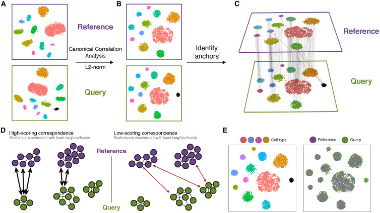

```{r knitr, include = FALSE}
DOCNAME = knitr::current_input()
DOCNAME = gsub(DOCNAME, pattern = ".Rmd", replacement = "")
knitr::opts_chunk$set(autodep        = TRUE,
                      cache          = FALSE,
                      cache.path     = paste0("cache/", DOCNAME, "/"),
                      cache.comments = TRUE,
                      echo           = TRUE,
                      error          = FALSE,
                      fig.align      = "center",
                      fig.path       = paste0("./img/", DOCNAME, "/"),
                      fig.width      = 8,
                      fig.height     = 5,
                      message        = FALSE,
                      warning        = FALSE)
```

**Motivation:**

The joint analysis of two or more single-cell datasets poses unique challenges. In particular, identifying cell populations that are present across multiple datasets can be problematic under standard workflows. Seurat v4 includes a set of methods to match (or ‘align’) shared cell populations across datasets. These methods first identify cross-dataset pairs of cells that are in a matched biological state (‘anchors’), can be used both to correct for technical differences between datasets (i.e. batch effect correction), and to perform comparative scRNA-seq analysis of across experimental conditions.


<details>
  <summary>**Figure caption**</summary>
(A) Representation of two datasets, reference and query, each of which originates from a separate single-cell experiment. The two datasets share cells from similar biological states, but the query dataset contains a unique population (in black).
(B) We perform canonical correlation analysis, followed by L2 normalization of the canonical correlation vectors, to project the datasets into a subspace defined by shared correlation structure across datasets.
(C) In the shared space, we identify pairs of MNNs across reference and query cells. These should represent cells in a shared biological state across datasets (gray lines) and serve as anchors to guide dataset integration. In principle, cells in unique populations should not participate in anchors, but in practice, we observe “incorrect” anchors at low frequency (red lines).
(D) For each anchor pair, we assign a score based on the consistency of anchors across the neighborhood structure of each dataset.
(E) We utilize anchors and their scores to compute “correction” vectors for each query cell, transforming its expression so it can be jointly analyzed as part of an integrated reference.
</details>

Below, we  demonstrate methods for  scRNA-seq integration as described in  [Stuart\*, Butler\* et al, 2019](https://www.cell.com/cell/fulltext/S0092-8674(19)30559-8) to perform a comparative analysis of human immune cells (PBMC) in either a [resting or interferon-stimulated state](https://www.nature.com/articles/nbt.4042). 

***

**Learning objectives:**
- Create an 'integrated' data assay for downstream analysis
- Identify cell types that are present in both datasets
- Assess integration success.

***

**Execution time: 40 minutes** if using at least 2 cores (that is, at least 16 virtual-CPUs). Expect longer time with slower hardware, and a RAM usage of some 40-100GB.

***

## Setup

We are going to start with the filtered and normalized datasets, and then we will recreate the clusters.

```{r}
library(tidyverse)
library(patchwork)
library(Seurat)
library(SeuratDisk)
library(sctransform)

sample_2 <- LoadH5Seurat("/work/Intro_scRNAseq_R/Results/sample_2.filt.norm.h5Seurat")
sample_3 <- LoadH5Seurat("/work/Intro_scRNAseq_R/Results/sample_3.filt.norm.h5Seurat")
```

First of all, we need to be able to distinguish both datasets. We will give them a new `sample` metadata column 

```{r}
sample_2$sample <- "sample_2"
Idents(sample_2) <- "sample"
sample_3$sample <- "sample_3"
Idents(sample_3) <- "sample"
```

Second, we need to make a list of datasets.

**Note:** it is extremely important that the datasets have been filtered and normalized separately before integration. Otherwise we will be introducing artifacts to the datasets that will be very undesirable.
```{r}
sample.list <- list(sample_2, sample_3)
```

## Default integration

Seurat default integration workflow uses two algorithms to merge datasets: canonical correlation analysis and mutual nearest neighbours. The former, Canonical correlation analysis (CCA), is an algorithm that enables the identification of shared sources of variation between datasets, while the latter is able to identify biologically matched cells in a pair of datasets. Thus, CCA-based integration therefore enables integrative analysis when experimental conditions or disease states introduce very strong expression shifts, or when integrating datasets across modalities and species. We will see in this section how to perform CCA and integrate our datasets.

### Feature selection

Before integrating the datasets, we will select features that are repeatedly variable across datasets for integration. As discussed in the previous lesson, we typically use 3,000 or more features for analyses downstream of `SCTransform`.

Then we will use the function` PrepSCTIntegration()`. This function takes in our list of datasets normalized with `SCTransform` and performs the following steps:

- Ensures that the sctransform residuals for the features specified to anchor.features are present in each object in the list. This is necessary because the default behavior of `SCTransform` is to only store the residuals for the features determined to be variable.
- Subsets the `scale.data` slot to only contain the residuals for `anchor.features` for efficiency in downstream processing.

```{r}
features <- SelectIntegrationFeatures(object.list = sample.list)
sample.list <- PrepSCTIntegration(object.list = sample.list, anchor.features = features)
```

### Selecting anchors

Through the identification of cell pairwise correspondences between single cells across datasets, termed **“anchors”**, Seurat can transform datasets into a shared space, even in the presence of extensive technical and/or biological differences. This enables the construction of harmonized atlases at the tissue or organism scale. To identify anchors, we use the `FindIntegrationAnchors()` function, which takes our list of Seurat objects as input, and then we use these anchors to integrate the two datasets together with `IntegrateData()`.

```{r}
sample.anchors <- FindIntegrationAnchors(object.list = sample.list, normalization.method = 'SCT', anchor.features = features)
sample.combined.sct <- IntegrateData(anchorset = sample.anchors, normalization.method = 'SCT')
```

### Combined dimensionality reduction

Now we can continue with our PCA, select an adequate number of PCs (remember that we use an increased number of PCs due to sctransform!).
```{r}
sample.combined.sct <- RunPCA(sample.combined.sct, verbose = FALSE)
sample.combined.sct <- RunUMAP(sample.combined.sct, reduction = "pca", dims = 1:30)
```

And finally we can visualize the integrated dataset.
```{r}
DimPlot(sample.combined.sct, reduction = "umap", group.by = "sample")
```

We should save our integrated object for further analysis.
```{r}
SaveH5Seurat(sample.combined.sct, filename = "/work/Intro_scRNAseq_R/Results/sample_23.filt.norm.red.h5Seurat")
```

## Reciprocal PCA

CCA is well-suited for identifying anchors when cell types are conserved. However, CCA-based integration may also lead to overcorrection, especially when a large proportion of cells are non-overlapping across datasets, and it is very time-consuming for large datasets. On the other hand, RPCA-based integration runs significantly faster, and also represents a more conservative approach where cells in different biological states are less likely to ‘align’ after integration. Therefore, it is recommend to use RPCA during integrative analysis where: 

* A substantial fraction of cells in one dataset have no matching type in the other 
* Datasets originate from the same platform (i.e. multiple lanes of 10x genomics) 
* There are a large number of datasets or cells to integrate

RPCA works by determining anchors between any two datasets and project each dataset into the others PCA space. Then it constrains the anchors by the same mutual neighborhood requirement as CCA. While the list of commands is nearly identical, this workflow requires users to run principal components analysis (PCA) -`RunPCA()` individually on each dataset prior to integration. Users should also set the `reduction` argument to ‘rpca’, when running `FindIntegrationAnchors()`.

### Reload the dataset list

```{r}
sample.list <- list(sample_2, sample_3)
```

```{r}
features <- SelectIntegrationFeatures(object.list = sample.list)
sample.list <- PrepSCTIntegration(object.list = sample.list, anchor.features = features)
sample.list <- lapply(X = sample.list, FUN = RunPCA, features = features)
```

```{r}
sample.anchors <- FindIntegrationAnchors(object.list = sample.list, normalization.method = "SCT",
    anchor.features = features, dims = 1:30, reduction = "rpca", k.anchor = 20)
sample.combined.sct <- IntegrateData(anchorset = sample.anchors, normalization.method = "SCT", dims = 1:30)
```

```{r}
sample.combined.sct <- RunPCA(sample.combined.sct, verbose = FALSE)
sample.combined.sct <- RunUMAP(sample.combined.sct, reduction = "pca", dims = 1:30)
```

```{r}
# Visualization
DimPlot(sample.combined.sct, reduction = "umap", group.by = "sample")
```

```{r}
# Visualization
DimPlot(sample.combined.sct, reduction = "pca", group.by = "sample", dims = c(4,5))
```

In general, we observe strikingly similar results between the standard workflow and the one demonstrated here, with substantial reduction in compute time and memory. However, if the datasets are highly divergent (for example, cross-modality mapping or cross-species mapping), where only a small subset of features can be used to facilitate integration, and you may observe superior results using CCA.

## Clustering integrated datasets

Performing clustering on SCT based integrated datasets is as easy as running again the commands from the previous lesson:

```{r}
sample.combined.sct <- FindNeighbors(sample.combined.sct, reduction = "pca", dims = 1:30)
sample.combined.sct <- FindClusters(sample.combined.sct, resolution = 0.5)
```

Then we can show the UMAP annotated with cluster information:
```{r}
DimPlot(sample.combined.sct, reduction = "umap", group.by = "integrated_snn_res.0.5")
```

***

## Assessing integration quality

How well went the integration? By looking at the UMAP plot, we can visually get an idea of how well mixed our two samples are. However, it would be better to check whether there is a proper balance in the number of cells of each sample inside each cluster. By counting the frequency of each sample in each cluster, we can display a bar plot that will help us to see sample proportions.

First we create a contingency table using the `xtabs()` function:
```{r}
df <- data.frame(xtabs(~sample + integrated_snn_res.0.5, data = sample.combined.sct@meta.data))

head(df, 10)
```

This frequency data frame is already in the correct format to create a ggplot barplot:

```{r}
freq_barplot <- ggplot(df) + geom_col(aes(x = integrated_snn_res.0.5, y = Freq, fill = sample))
freq_barplot
```

The plot shows generally a pretty good balance between the sample origin in the clusters. Nonetheless, the frequency shown here does not take into account the total number of cells in each of the samples:

```{r}
table(sample.combined.sct$sample)
```

We should correct by that! We will need to calculate the proportion of cells that come from each sample for each cluster:
```{r}
df <- df %>% group_by(sample) %>%
  mutate(sum_freq = sum(Freq)) %>%
  ungroup() %>%
  # calculate percentage
  mutate(percentage = Freq / sum_freq * 100)
```

```{r}
per_barplot <- ggplot(df) + geom_col(aes(x = integrated_snn_res.0.5, y = percentage, fill = sample))
per_barplot
```
We can compare both plots:

```{r, fig.width= 10, fig.height=5}
freq_barplot + per_barplot
```

The balance looks a bit better now! We can perform a statistical test to check if there are significant differences between the sample composition of the clusters using a paired Wilcox test:

```{r}
# Reshape frequency data frame so it has the right format for statistical testing. We remove the Freq and sum_freq variables from it.
df_reshaped <- pivot_wider(
  data = df %>% select(-Freq, -sum_freq),
  names_from = sample,
  values_from = percentage,
  values_fill = NA
)
```

Moving column with cluster names to rownames.

```{r}
df_reshaped <- data.frame(df_reshaped)
rownames(df_reshaped) <- df_reshaped$integrated_snn_res.0.5
df_reshaped <- df_reshaped[,-1]
```

Perform statistical test. Our null hypothesis is that there is no difference in the sample composition of our clusters.

```{r}
wilcox.test(df_reshaped$sample_2, df_reshaped$sample_3, paired = T)
```

With a p-value > 0.05 we cannot reject our null hypothesis and we can conclude that there is no statistical difference in the composition of our clusters. Great!
We can also perform a Chi square test directly on sample frequency of our clusters!

```{r}
# Reshape frequency data frame so it has the right format for statistical testing. We remove the percentage and sum_freq variables from it.
df_reshaped <- pivot_wider(
  data = df %>% select(-percentage, -sum_freq),
  names_from = sample,
  values_from = Freq,
  values_fill = NA
)
```

Moving column with cluster names to rownames

```{r}
df_reshaped <- data.frame(df_reshaped)
rownames(df_reshaped) <- df_reshaped$integrated_snn_res.0.5
df_reshaped <- df_reshaped[,-1]
```

Perform statistical test. Our null hypothesis is that there is no difference in the sample composition of our clusters.

```{r}
chisq.test(df_reshaped$sample_2, df_reshaped$sample_3, simulate.p.value = T)
```

With a p-value > 0.05 we cannot reject our null hypothesis and we can conclude that there is no statistical difference in the composition of our clusters. Great!
We can also perform a Chi square test directly on sample frequency of our clusters!

***

## Differential Expression Analysis of integrated datasets

For performing differential expression after integration, **we switch back to the SCT Assay**! This is extremelly important since the `integrated` Assay only contains the anchored features that we selected in the integration steps.

```{r}
DefaultAssay(sample.combined.sct) <- "SCT"
```

### Check conserved markers across conditions

Our dataset now is set to the SCT assay. We also need to remember that our data is normalized, but it is not corrected by our batch "sample". This means that if we try to find markers using the `FindAllMarkers()`, it will not take into account the differences due to batch effects. To identify canonical cell type marker genes that are conserved across conditions, Seurat provides the `FindConservedMarkers()` function. This function performs differential gene expression testing for each dataset/group and combines the p-values using meta-analysis methods from the `MetaDE` R package.

```{r}
markers_cluster6 <- FindConservedMarkers(sample.combined.sct, ident.1 = 6, grouping.var = "sample", verbose = FALSE)
head(markers_cluster6)
```

**The output from the `FindConservedMarkers()` function**, is a matrix containing a ranked list of putative markers listed by gene ID for the cluster we specified, and associated statistics. Note that the same set of statistics are computed for each group (in our case, sample_2 and sample_3) and the last two columns correspond to the combined p-value across the two groups. We describe some of these columns below:

- **gene:** gene symbol
- **condition_p_val:** p-value not adjusted for multiple test correction for condition
- **condition_avg_logFC:** average log fold change for condition. Positive values indicate that the gene is more highly expressed in the cluster.	
- **condition_pct.1:** percentage of cells where the gene is detected in the cluster for condition		
- **condition_pct.2:** percentage of cells where the gene is detected on average in the other clusters for condition
- **condition_p_val_adj:** adjusted p-value for condition, based on bonferroni correction using all genes in the dataset, used to determine significance
- **max_pval:**	largest p value of p value calculated by each group/condition
- **minimump_p_val:** combined p value

>**NOTE:** Since each cell is being treated as a replicate this will result in inflated p-values within each group! A gene may have an incredibly low p-value < 1e-50 but that doesn't translate as a highly reliable marker gene. 

When looking at the output, **we suggest looking for markers with large differences in expression between `pct.1` and `pct.2` and larger fold changes**. For instance if `pct.1` = 0.90 and `pct.2` = 0.80, it may not be as exciting of a marker. However, if `pct.2` = 0.1 instead, the bigger difference would be more convincing. Also, of interest is if the majority of cells expressing the marker is in my cluster of interest. If `pct.1` is low, such as 0.3, it may not be as interesting. Both of these are also possible parameters to include when running the function, as described above.

We can visualize the markers using the same functions we have used before:

```{r, fig.width=10, fig.height=3}
DotPlot(sample.combined.sct, features = rownames(markers_cluster6)[1:10]) + NoLegend()
```

### Identify differential expressed genes across conditions:

It is possible to do a comparative analyses and look at the differences induced by stimulation. Because we are confident in having identified common cell types across condition, we can ask what genes change in different conditions for cells of the same type. First, we create a column in the meta.data slot to hold both the cell type and stimulation information and switch the current ident to that column. Then we use FindMarkers() to find the genes that are different between samples. 

```{r}
sample.combined.sct$cluster.sample <- paste(Idents(sample.combined.sct), sample.combined.sct$sample, sep = "_")
sample.combined.sct$celltype <- Idents(sample.combined.sct)
Idents(sample.combined.sct) <- "cluster.sample"
```

Since we have run SCTransform in each sample dataset individually, we have created a merged object with multiple SCT models. In order to use th FindMarkers function between our integrated datasets, we have to prepare the integrated object using the `PrepSCTFindMarkers()` function. This function uses minimum of the median UMI (calculated using the raw UMI counts) of individual objects to reverse the individual SCT regression model using minimum of median UMI as the sequencing depth covariate. The counts slot of the SCT assay is replaced with recorrected counts and the data slot is replaced with log1p of recorrected counts.

```{r}
sample.combined.sct <- PrepSCTFindMarkers(sample.combined.sct)
markers_cluster1_samples <- FindMarkers(sample.combined.sct, ident.1 = "1_sample_2", ident.2 = "1_sample_3", verbose = FALSE)
head(markers_cluster1_samples, n = 15)
```

We can check on the expression on a feature plot. We can use the `split.by` argument to separate our cells based on a metadata column (in our case, `sample`). 
We are also focusing on cluster 1 cells.

```{r, fig.height=9, fig.width=6}
cluster_1_cells <- colnames(sample.combined.sct)[sample.combined.sct$seurat_clusters == 1]
FeaturePlot(sample.combined.sct, features = c("PGP", "BOD1L2", "GLIPR1L1"), split.by = "sample", cells = cluster_1_cells,
    cols = c("grey", "red"))
```

## Save dataset

```{r}
SaveH5Seurat(sample_2, filename = "/work/Intro_scRNAseq_R/Results/sample_23.filt.norm.red.clust.h5Seurat")
```

***

## Exercise
Try to identify which cell types do we have in each cluster following the same procedures we used in the previous lesson. Remember to use `FindConservedMarkers()` to take into account differences between our batches!

***

## Wrapping up

This notebook completes the integration of the datasets. We have both used the standard PCA and then a version of the PCA that can model transcript distribution and takes batches into account. Then, we used a statistical test to check that the integration has been successful. We have also learned how to perform clustering on integrated dataset and how to perform DEA across and in between conditions.

