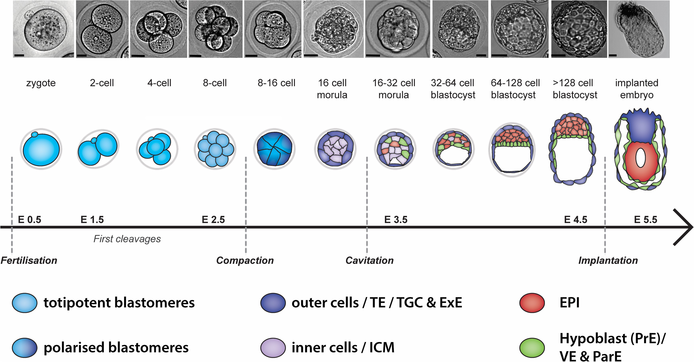

```{r knitr, include = FALSE}
DOCNAME = knitr::current_input()
knitr::opts_chunk$set(autodep        = TRUE,
                      cache          = FALSE,
                      cache.path     = paste0("cache/", DOCNAME, "/"),
                      cache.comments = TRUE,
                      echo           = TRUE,
                      error          = FALSE,
                      fig.align      = "center",
                      fig.width      = 10,
                      fig.height     = 8,
                      message        = FALSE,
                      warning        = FALSE)
```

# Introduction

scRNAseq data analysis of [Deng et al. (2014)](https://www.science.org/doi/10.1126/science.1245316). This study follows the early embryonic development of mouse cells from zygote to late blastocists (and some adult cells).



# Load libraries
```{r message=FALSE, results='hide'}
library(rhdf5)
library(tidyverse)
library(Seurat)
library(SeuratWrappers)
library(patchwork)
library(biomaRt)
library(slingshot)
library(gprofiler2)
```

# Load dataset

Data is a matrix of cells in columns and genes in rows. We specify that the row names (our genes) are in the first column.
```{r message=FALSE}
raw_data <- read.delim("../../Data/example_data/GSE45719_cts.txt", sep = "\t", row.names = 1)
head(raw_data, n = 5)
```

Here is the metadata. The column names of `raw_data` are the same as the row names of metadata.
```{r}
metadata <- read.delim("../../Data/example_data/GSE45719_metadata.tsv", header = T, sep = "\t", quote = "", stringsAsFactors = F, row.names = 1)
head(metadata, n = 5)
```

For the purposes of this workshop, the metadata of this project has been simplified. The most interesting variable is **Cell_type**, which shows the developmental stage of our cells. Cell type is not ordered by its differentiation stage, but we can do that now:

```{r}
metadata$Cell_type <- factor(metadata$Cell_type, 
                             levels = c("MII Oocyte","Zygote",
                                        "Early 2-cell","Mid 2-cell","Late 2-cell",
                                        "4-cell","8-cell","16-cell",
                                        "Early blastocyst","Mid blastocyst","Late blastocyst", 
                                        "Fibroblast","Adult"))
```

There are some cell types that we are not really interested in, and will be removed in the next step below.

## Seurat object

Now that we have our data loaded, we can create a **Seurat Object**, from which we will perform our analysis. The function `CreateSeuratObject()` takes as arguments our count matrix, metadata and several options for filtering the data:

- `min.cells` will keep features (genes) that are detected in at least this many cells.
- `min.features` will keep cells with at least this many features detected.

This will prevent from keeping cells and genes with an immense majority of 0's as values. In addition, we are removing some cell types we do not want to analyse.
```{r}
raw_ann <- CreateSeuratObject(counts = raw_data, meta.data = metadata, min.cells = 3, min.features = 200,)
raw_ann <- subset(raw_ann, cells = colnames(raw_ann)[!raw_ann$Cell_type %in% c("MII Oocyte","Fibroblast","Adult")])
```

# Quality Control

The Seurat object initialization step above only considered cells that expressed at least 300 genes and genes detected in at least 3 cells. Here is how many cells and genes we start with:

```{r}
print(paste0("Before filtering: ", dim(raw_ann)[2], " cells ",  dim(raw_ann)[1], " genes"))
```

Additionally, we would like to exclude cells that are damaged. A common metric to judge this (although by no means the only one) is the relative expression of mitochondrially derived genes. When the cells apoptose due to stress, their mitochondria becomes leaky and there is widespread RNA degradation. Thus a relative enrichment of mitochondrially derived genes can be a tell-tale sign of cell stress. Here, we compute the proportion of transcripts that are of mitochondrial origin for every cell (*percent.mito*), and visualize its distribution as a violin plot. We also use the `GenePlot()` function to observe how percent.mito correlates with other metrics.

```{r}
raw_ann[['percent.mito']] <- PercentageFeatureSet(raw_ann, pattern = "^mt-")
```

Now, sometimes, mitochondrial genes are a bit tricky to find, specially if your genes are not gene names, but gene IDs. You might have already a collection of gene names you want to use, but it is not always the case. Therefore, it might very useful to have some extra annotation on our genes which will help to select mitochondrial genes (or ERCC genes and ribosomal genes). Since this dataset was aligned using the mouse genome version *mm9*, we will use the mm9 annotation from [Biomart](http://www.biomart.org/). The package **biomaRt** will do the job!

```{r}
ensembl67=useMart(host='http://feb2014.archive.ensembl.org/', # select latest version of mm9 genome annotation
                  biomart='ENSEMBL_MART_ENSEMBL', dataset = "mmusculus_gene_ensembl")

# we get a list of annotations we would like to fetch
mm9.gene.annotations <- biomaRt::getBM(mart = ensembl67, attributes=c("ensembl_gene_id", "external_gene_id", "description", "chromosome_name"))
head(mm9.gene.annotations)
```

We select that mitochondrial genes are those with the **chromosome_name** annotation equal to "MT".
```{r}
mt_genes <- mm9.gene.annotations %>% filter(chromosome_name == "MT") %>% pull(external_gene_id)
mt_genes <- mt_genes %in% rownames(raw_ann)

raw_ann[['percent.mito']] <- PercentageFeatureSet(raw_ann, features = mt_genes)
```

If your data contains spike-ins (ERCC genes), you can also compute the proportion of transcripts belonging to them. Furthermore, it might be useful to calculate the percentage of reads aligned to ribosomal genes, since it has been shown that they can skew the data due to their high variability.

```{r}
raw_ann[['percent.ercc']] <- PercentageFeatureSet(raw_ann, pattern = "^ERCC-")
raw_ann[['percent.ribo']] <- PercentageFeatureSet(raw_ann, pattern = "^Rp[ls]")
```

Nonetheless, in this experiment there aren't ERCC genes or mitochondrial genes:

```{r}
sum(raw_ann$percent.ercc)
sum(raw_ann$percent.mito)
```

## Visualizations

It is extremely useful to visualize QC measurements calculated so far. Violin plots (fancy boxplots) are a great way to check the distribution of values of all our QC measurements. When initializing the Seurat Object, Seurat calculates also the number of genes detected and the total library size per cell. 

```{r QC_before_filter, fig.width=12, fig.height=5}
VlnPlot(raw_ann, 
        features = c("nFeature_RNA", "nCount_RNA", "percent.ribo"),
        ncol = 4, group.by = "Cell_type")
```

It seems that the late 2-cells have a very high total number of reads. We should not filter them out, there are very few! In addition, our percentage of ribosomal counts is also quite low (maximum is ~5%).

We can check the relationship between library size and number of genes detected:

```{r QC_before_filtering2, fig.height=4, fig.width=6}
FeatureScatter(raw_ann, feature1 = "nCount_RNA", feature2 = "nFeature_RNA", group.by = "Cell_type")
```
In other experiment with more cells, we might consider removing cells with an unexpectedly high number of detected genes and reads. These cells might be doublets, that is, two cells that were sequenced together! 

## Filtering
Some automatic filtering can be made using quantiles! Using the extreme upper and lower quantiles (0.99 and 0.01) we can make sure that outliers are removed. In this case, we will remove cells with very low library size and genes detected (lower than quantile 0.01).

```{r}
feature_min <- quantile(raw_ann$nFeature_RNA, probs = 0.01)
count_min <- quantile(raw_ann$nCount_RNA, probs = 0.01)
```

We can subset our dataset using the function `subset()`.
```{r}
adata <- subset(raw_ann, subset = 
                    nFeature_RNA > feature_min  & 
                    nCount_RNA > count_min)

rm(raw_ann) # we remove the initial unfiltered dataset to reduce computational resources, this is not necessary!
```

Finally, this is how many cells and genes we have after filtering:
```{r}
print(paste0("After filtering: ", dim(adata)[2], " cells ",  dim(adata)[1], " genes"))
```

And this is how our filtered data looks like:
```{r QC_after_filtering, fig.width=12, fig.height=5}
VlnPlot(adata, 
        features = c("nFeature_RNA", "nCount_RNA", "percent.ribo"),
        ncol = 4, group.by = "Cell_type")
```

# Exploratory analysis

## Normalization

Now that the data is filtered, we can proceed to normalize our count matrix. Seurat normalizes the gene expression measurements for each cell by the total expression, multiplies this by a scale factor (10,000 by default), and log-transforms the result. There have been many methods to normalize the data, but this is the simplest and the most intuitive. The division by total expression is done to change all expression counts to a relative measure, since experience has suggested that technical factors (e.g. capture rate, efficiency of reverse transcription) are largely responsible for the variation in the number of molecules per cell, although genuine biological factors (e.g. cell cycle stage, cell size) also play a smaller, but non-negligible role. The log-transformation is a commonly used transformation that has many desirable properties, such as variance stabilization (can you think of others?).

```{r message=FALSE, warning=FALSE}
adata <- NormalizeData(adata)
adata <- FindVariableFeatures(adata, selection.method = "vst", nfeatures = 2000)
```

## Identification of Variable Genes 
Identify most variable genes and label top 5 most highly variable.
```{r top_variable_genes, fig.width = 6, fig.height=4}
top10 <- head(VariableFeatures(adata), 5)
LabelPoints(plot = VariableFeaturePlot(adata), points = top10, repel = T)
```

## Scale

Gene expression scaling is necessary for proper clustering of our cells. Since genes may be expressed in very different orders of magnitude, extreme expression levels may drive the separation between cells and bias the results.
```{r message=FALSE, warning=FALSE, results='hide'}
adata <- ScaleData(adata)
```

## PCA

We can perform a Principal Component analysis using the following function. PCA can be used for visualization of our cells, as well as clustering and other dimensionality reduction methods such as t-SNE or UMAP.
```{r, results='hide'}
adata <- RunPCA(adata)
```
We can also calculate and visualize the importance of each gene for each Principal Component.
```{r results='hide'}
pcalod_1 <- VizDimLoadings(object = adata, dims = 1) + theme(axis.text.y = element_text(size = 8)) 
pcalod_2 <- VizDimLoadings(object = adata, dims = 2) + theme(axis.text.y = element_text(size = 8))
```


```{r PCA_loadings, fig.height = 5, fig.width=10}
CombinePlots(plots = list(pcalod_1, pcalod_2), ncol = 2)
```

Visualization only show negative loadings cause there are many more than positives. We can see a balanced plot using *balance = TRUE*
```{r results = 'hide'}
pcalod_1 <- VizDimLoadings(object = adata, dims = 1, balanced = TRUE) + theme(axis.text.y = element_text(size = 8)) 
pcalod_2 <- VizDimLoadings(object = adata, dims = 2, balanced = TRUE) + theme(axis.text.y = element_text(size = 8))
```


```{r PCA_loadings_balanced, fig.height = 5}
CombinePlots(plots = list(pcalod_1, pcalod_2), ncol = 2)
```

## Cell clustering
Now that we have calculated our components, we can proceed to select the number of PCs necessary to perform clustering. There are two methods that we can use to determine the proper number of dimensions:

### PC selection

**Jackstraw method**

The Jackstraw method randomly permutes a subset of data, and calculates projected PCA scores for these 'random' genes. Then compares the PCA scores for the 'random' genes with the observed PCA scores to determine statistical significance. End result is a p-value for each gene's association with each principal component.

```{r jackstraw, fig.height=5, fig.width=7}
adata <- JackStraw(adata, num.replicate = 100)
adata <- ScoreJackStraw(adata, dims = 1:20)
JackStrawPlot(adata, dims = 1:20)
```

As you can see in the plot above, there is a change in the orders of magnitude of the PCs' p-values. Suggesting that we may cut off around PC8. 

**Elbow method**

The elbow method allows us to explore the explained variation of each of the Principal Components. The plot usually looks like an "elbow", where adding more PCs does not really contribute to the amount of explained variation. We can see again that we reach a plateau around PC6 or PC8.

```{r elbow_plot}
ElbowPlot(adata)
```

### Clustering
We could include 6 PCs, but it does not hurt to use more; there are very few cells in this experiment and we would like to include as much information as possible. Use the `resolution` argument of the `FindClusters()` function to fine-tune the number of clusters to find. The larger the number the less clusters it will find.

```{r}
adata <- FindNeighbors(adata, dims = 1:20)
adata <- FindClusters(adata, resolution = 0.8)
```

# Visualization

```{r}
adata <- RunTSNE(adata)
adata <- RunUMAP(adata, dims = 1:20)
```

## PCA
```{r PCA_plot, fig.height=5, fig.width=10}
DimPlot(adata, reduction = "pca", group.by = c('Cell_type')) + 
  DimPlot(adata, reduction = "pca", group.by = c('seurat_clusters'))
```

## UMAP
```{r UMAP_plot, fig.height=5, fig.width=12}
p1 <- DimPlot(adata, reduction = "umap", group.by = 'Cell_type')
p2 <- DimPlot(adata, reduction = "umap")
p1 + p2
```

## TSNE
```{r TSNE_plot, fig.height=5, fig.width=12}
p3 <- DimPlot(adata, reduction = "tsne", group.by = 'Cell_type')
p4 <- DimPlot(adata, reduction = "tsne")
p3 + p4
```

# Differential Expression Analysis

Differential testing works a bit different than in bulk RNA-Seq analysis. Usually, your experiment will include dozens or hundreds of cells per cluster/condition. We can make use of Wilcox tests and multiple testing correction to identify statistically significant genes using the `FindAllMarkers()` function. This function will gather all "markers" for each of your *Ident* variable values (your conditions or identified clusters). 
```{r}
markers <- FindAllMarkers(adata,logfc.threshold = 0.5, only.pos = T)
```

```{r}
markers %>%
    group_by(cluster) %>%
    top_n(n = 10, wt = avg_log2FC) -> top10

head(top10)
```

On the other hand, if you want to make a specific comparison, you can use the `FindMarkers()` function:
```{r}
cluster2.markers <- FindMarkers(adata, ident.1 = 2, min.pct = 0.5, only.pos = T) # Only cluster 2 markers
cluster2.markers %>% arrange(desc(avg_log2FC)) %>% head(10)
```

Even compare specific clusters against others by selecting `ident.1` and `ident.2`:
```{r}
cluster5.markers <- FindMarkers(adata, ident.1 = 5, ident.2 = c(0, 3), # Differences between cluster 5 and clusters 0 and 3
                                min.pct = 0.5, only.pos = T) 
```

## Visualizations

We can visualize all markers in a heatmap just like this! To go easy on the visualization, we only use the top 10 markers.
```{r DEA_heatmap, fig.height=6}
DoHeatmap(adata, features = top10$gene) + NoLegend()
```

We can also plot the expression on our PCA, tSNE or UMAP. We only need to pass a vector of genes to the `features` argument of `FeaturePlot()`
```{r DEA_feature}
FeaturePlot(adata, features = top10$gene[1:4], reduction = "pca")
```

Or as a violin plot, a ridge plot or a dot plot.
```{r DEA_violin, fig.height=5, fig.width=7}
VlnPlot(adata, features = top10$gene[1]) + RidgePlot(adata, features = top10$gene[1])
```

```{r DEA_dotplot}
DotPlot(adata, features = top10$gene[1:10])
```

# Functional analysis with gprofiler2
`gost()` function allows us to do functional profiling of gene lists, such as our differentially expressed genes. The function performs statistical enrichment analysis to find over-representation of terms from Gene Ontology, biological pathways like KEGG and Reactome, human disease annotations, etc. This is done by using hypergeometric tests that are corrected for multiple testing.

## Single query
A standard input of the `gost()` function is a (named) list of gene identifiers. The list can consist of mixed types of identifiers (proteins, transcripts, microarray IDs, etc), SNP IDs, chromosomal intervals or functional term IDs.

The result is a named list where *result* is a data.frame with the enrichment analysis results and *meta* containing a named list with all the metadata for the query.

```{r}
gostres <- gost(query = rownames(cluster2.markers), 
                organism = "mmusculus", ordered_query = FALSE, 
                multi_query = FALSE, significant = FALSE, exclude_iea = FALSE, 
                measure_underrepresentation = FALSE, evcodes = FALSE, 
                user_threshold = 0.05, correction_method = "g_SCS", 
                domain_scope = "annotated", custom_bg = NULL, 
                numeric_ns = "", sources = NULL, as_short_link = FALSE)

head(gostres$result)
```

The result data.frame contains the following columns:
```{r}
names(gostres$meta)
```

## Multiple queries
The function `gost()` also allows to perform enrichment on multiple input gene lists. Multiple queries are automatically detected if the input query is a list of vectors with gene identifiers and the results are combined into identical data.frame as in case of single query.
```{r}
multi_gostres1 <- gost(query = list("chromX" = c("X:1000:1000000", "rs17396340", 
                                                 "GO:0005005", "ENSG00000156103", "NLRP1"),
                             "chromY" = c("Y:1:10000000", "rs17396340", 
                                          "GO:0005005", "ENSG00000156103", "NLRP1")), 
                       multi_query = FALSE)

head(multi_gostres1$result, 3)
```

The column “query” in the result dataframe will now contain the corresponding name for the query. If no name is specified, then the query name is defined as the order of query with the prefix “query_.”
Another option for multiple gene lists is setting the parameter `multiquery = TRUE`. Then the results from all of the input queries are grouped according to term IDs for better comparison.

```{r}
multi_gostres2 <- gost(query = list("chromX" = c("X:1000:1000000", "rs17396340",
                                                 "GO:0005005", "ENSG00000156103", "NLRP1"),
                             "chromY" = c("Y:1:10000000", "rs17396340", 
                                          "GO:0005005", "ENSG00000156103", "NLRP1")), 
                       multi_query = TRUE)

head(multi_gostres2$result, 3)
```

## Visualization
The enrichment results are visualized with a Manhattan-like-plot using the function `gostplot()` and the previously found gost results *gostres*:

```{r gost_interactive}
#gostplot(gostres, capped = TRUE, interactive = TRUE)
```

The function `publish_gostplot()` takes the static plot object as an input and enables to highlight a selection of interesting terms from the results with numbers and table of results. These can be set with parameter highlight_terms listing the term IDs in a vector or as a data.frame with column “term_id” such as a subset of the result dataframe.

First we create the static plot
```{r gost_static}
p <- gostplot(gostres, capped = FALSE, interactive = FALSE)
p
```

Then we make it in high quality. We can add highlighted terms if we want with the *highlight_terms* argument.
```{r gost_publishing}
pp <- publish_gostplot(p, highlight_terms = c("CORUM:3047"),
                       width = NA, height = NA, filename = NULL )
```

The gost results can also be visualized with a table. The `publish_gosttable()` function will create a nice-looking table with the result statistics for the highlight_terms from the result data.frame. The highlight_terms can be a vector of term IDs or a subset of the results.

```{r gost_table}
publish_gosttable(gostres, highlight_terms = gostres$result[c(1:10),],
                        use_colors = TRUE, 
                        show_columns = c("source", "term_name", "term_size", "intersection_size"),
                        filename = NULL) 
```

# Pseudotime

We will use the package [Slignshot](https://bioconductor.org/packages/release/bioc/vignettes/slingshot/inst/doc/vignette.html). Slingshot was designed to model developmental trajectories in single-cell RNA sequencing data and serve as a component in an analysis pipeline after dimensionality reduction and clustering.

```{r}
adata_SCE <- as.SingleCellExperiment(adata)
sde <- slingshot(adata_SCE, reducedDim = 'PCA')
```

The using the `slingshot` package it is possible to plot our components and the calculated trajectory. Unfortunately, it does not work with ggplot. 

```{r sling_pseudo_plot}
cols <- colorRampPalette(viridis::viridis(3))
cols <- cols(50)[cut(sde$slingPseudotime_1, breaks=50)]
plot(reducedDim(adata_SCE, "PCA"), pch=16, col = cols) # adata_SCE contains, PC1 and PC2, and colored by pseudotime
lines(slingshot::SlingshotDataSet(sde), lwd = 2) # here we plot the trajectory
```

It is possible to create a `FeaturePlot()` with both pseudotime and the trajectory by extracting the information from our `slingshot` object and add it to our `Seurat` object, but it is a bit inconvenient. First, pseudotime can be extracted with the function `slingPseudotime()`. The trajectory curves are stored inside the slingshot object `sde`; in this case, it is easier since there is only one trajectory. 

```{r}
adata$pseudotime <- slingPseudotime(sde)
trajectory <- data.frame(SlingshotDataSet(sde)@curves[["Lineage1"]][["s"]])
head(trajectory)
```

Now we can use Seurat functions to plot the pseudotime and the calculated trajectory!
```{r pseudo_plot, fig.height = 4, fig.width=5}
FeaturePlot(adata, features = "pseudotime", reduction = "pca") + scale_color_viridis_c() + geom_path(data = trajectory, aes(x = PC_1, y = PC_2))
```

```{r fig.height = 4, fig.width = 5.7}
DimPlot(adata, group.by = "Cell_type", reduction = "pca")
```

We can create a plot that sorts our cells by pseudotime and check that it corresponds to their cell type:
```{r pseudo_order}
adata_SCE$pseudotime <- as.numeric(slingPseudotime(sde))
ggplot(as.data.frame(colData(adata_SCE)), aes(x = pseudotime,
                                             y = Cell_type,
                                             colour = Cell_type)) +
  ggbeeswarm::geom_quasirandom(groupOnX = FALSE) +
  theme_classic() +
  xlab("Slingshot pseudotime") + ylab("Timepoint") +
  ggtitle("Cells ordered by Slingshot pseudotime")
```

# Session info
Finally, we create a `session_info()` table that will allow anyone to check what versions of R and packages are we using for reproducibility purposes.

```{r session-info, cache = FALSE}
devtools::session_info()
```
