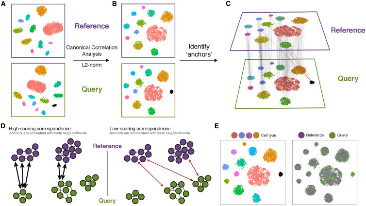

# Integration of datasets

!!! note "Section Overview"

    &#128368; **Time Estimation:** 40 minutes if using at least 2 cores (that is, at least 16 virtual-CPUs). Expect longer time with slower hardware, and a RAM usage of some 40-100GB.

    &#128172; **Learning Objectives:**    

    1. Create an 'integrated' data assay for downstream analysis
    2. Identify cell types that are present in both datasets
    3. Assess integration success.

The joint analysis of two or more single-cell datasets poses unique challenges. In particular, identifying cell populations that are present across multiple datasets can be problematic under standard workflows. Seurat v4 includes a set of methods to match (or ‘align’) shared cell populations across datasets. These methods first identify cross-dataset pairs of cells that are in a matched biological state (‘anchors’), can be used both to correct for technical differences between datasets (i.e. batch effect correction), and to perform comparative scRNA-seq analysis of across experimental conditions.

 !!! info "Figure caption"

    (A) Representation of two datasets, reference and query, each of which originates from a separate single-cell experiment. The two datasets share cells from similar biological states, but the query dataset contains a unique population (in black).

    (B) We perform canonical correlation analysis, followed by L2 normalization of the canonical correlation vectors, to project the datasets into a subspace defined by shared correlation structure across datasets.

    (C) In the shared space, we identify pairs of MNNs across reference and query cells. These should represent cells in a shared biological state across datasets (gray lines) and serve as anchors to guide dataset integration. In principle, cells in unique populations should not participate in anchors, but in practice, we observe "incorrect" anchors at low frequency (red lines).

    (D) For each anchor pair, we assign a score based on the consistency of anchors across the neighborhood structure of each dataset.

    (E) We utilize anchors and their scores to compute "correction" vectors for each query cell, transforming its expression so it can be jointly analyzed as part of an integrated reference.

Below, we demonstrate methods for scRNA-seq integration as described in [Stuart\*, Butler\* et al, 2019](https://www.cell.com/cell/fulltext/S0092-8674(19)30559-8) to perform a comparative analysis of human immune cells (PBMC) in either a [resting or interferon-stimulated state](https://www.nature.com/articles/nbt.4042).

# Setup

``` r
library(tidyverse)
library(patchwork)
library(Seurat)
library(SeuratDisk)
library(sctransform)
library(kBET)

LoadH5Seurat("../../Data/notebooks_data/sample_2.filt.norm.h5Seurat")
LoadH5Seurat("../../Data/notebooks_data/sample_3.filt.norm.h5Seurat")
```

First of all, we need to make a list of datasets.

``` r
sample.list <- list(sample_2, sample_3)
```

!!! warning

    It is extremely important that the datasets have been filtered and normalized separately before integration. Otherwise we will be introducing artifacts to the datasets that will be very undesirable.

## Default integration

Seurat default integration workflow uses two algorithms to merge datasets: canonical correlation analysis and mutual nearest neighbours. The former, Canonical correlation analysis (CCA), is an algorithm that enables the identification of shared sources of variation between datasets, while the latter is able to identify biologically matched cells in a pair of datasets. Thus, CCA-based integration therefore enables integrative analysis when experimental conditions or disease states introduce very strong expression shifts, or when integrating datasets across modalities and species. We will see in this section how to perform CCA and integrate our datasets.

### Feature selection

Before integrating the datasets, we will select features that are repeatedly variable across datasets for integration. As discussed in the previous lesson, we typically use 3,000 or more features for analyses downstream of `SCTransform`.

Then we will use the function`PrepSCTIntegration()`. This function takes in our list of datasets normalized with `SCTransform` and performs the following steps:

- Ensures that the sctransform residuals for the features specified to anchor.features are present in each object in the list. This is necessary because the default behavior of `SCTransform` is to only store the residuals for the features determined to be variable.
- Subsets the `scale.data` slot to only contain the residuals for `anchor.features` for efficiency in downstream processing.

``` r
features <- SelectIntegrationFeatures(object.list = sample.list, nfeatures = 3000)
sample.list <- PrepSCTIntegration(object.list = sample.list, anchor.features = features)
```

### Selecting anchors

Through the identification of cell pairwise correspondences between single cells across datasets, termed **"anchors"**, Seurat can transform datasets into a shared space, even in the presence of extensive technical and/or biological differences. This enables the construction of harmonized atlases at the tissue or organism scale. To identify anchors, we use the `FindIntegrationAnchors()` function, which takes our list of Seurat objects as input, and then we use these anchors to integrate the two datasets together with `IntegrateData()`.

``` r
sample.anchors <- FindIntegrationAnchors(object.list = sample.list, normalization.method = 'SCT', anchor.features = features)
sample.combined.sct <- IntegrateData(anchorset = sample.anchors, normalization.method = 'SCT')
```

### Combined dimensionality reduction

Now we can continue with our PCA, select an adequate number of PCs (remember that we use an increased number of PCs due to sctransform!).

``` r
sample.combined.sct <- RunPCA(sample.combined.sct, verbose = FALSE)
sample.combined.sct <- RunUMAP(sample.combined.sct, reduction = "pca", dims = 1:30)
```

And finally we can visualize the integrated dataset.

``` r
DimPlot(sample.combined.sct, reduction = "umap")
```

We should save our integrated object for further analysis.

``` r
SaveH5Seurat(sample.combined.sct, filename = "../../Data/notebooks_data/sample_123.filt.norm.red.h5Seurat")
```

## Reciprocal PCA

CCA is well-suited for identifying anchors when cell types are conserved. However, CCA-based integration may also lead to overcorrection, especially when a large proportion of cells are non-overlapping across datasets, and it is very time-consuming for large datasets. On the other hand, RPCA-based integration runs significantly faster, and also represents a more conservative approach where cells in different biological states are less likely to ‘align’ after integration. Therefore, it is recommend to use RPCA during integrative analysis where:

- A substantial fraction of cells in one dataset have no matching type in the other
- Datasets originate from the same platform (i.e. multiple lanes of 10x genomics)
- There are a large number of datasets or cells to integrate

RPCA works by determining anchors between any two datasets and project each dataset into the others PCA space. Then it constrains the anchors by the same mutual neighborhood requirement as CCA. While the list of commands is nearly identical, this workflow requires users to run principal components analysis (PCA) -`RunPCA()` individually on each dataset prior to integration. Users should also set the `reduction` argument to ‘rpca’, when running `FindIntegrationAnchors()`.

``` r
# Reload the dataset list
sample.list <- list(sample_2, sample_3)
```

``` r
features <- SelectIntegrationFeatures(object.list = sample.list, nfeatures = 3000)
sample.list <- PrepSCTIntegration(object.list = sample.list, anchor.features = features)
sample.list <- lapply(X = sample.list, FUN = RunPCA, features = features)
```

``` r
sample.anchors <- FindIntegrationAnchors(object.list = sample.list, normalization.method = "SCT",
    anchor.features = features, dims = 1:30, reduction = "rpca", k.anchor = 20)
sample.combined.sct <- IntegrateData(anchorset = sample.anchors, normalization.method = "SCT", dims = 1:30)
```

``` r
sample.combined.sct <- RunPCA(sample.combined.sct, verbose = FALSE)
sample.combined.sct <- RunUMAP(sample.combined.sct, reduction = "pca", dims = 1:30)
```

``` r
# Visualization
DimPlot(sample.combined.sct, reduction = "umap")
```

In general, we observe strikingly similar results between the standard workflow and the one demonstrated here, with substantial reduction in compute time and memory. However, if the datasets are highly divergent (for example, cross-modality mapping or cross-species mapping), where only a small subset of features can be used to facilitate integration, and you may observe superior results using CCA.

## Assessing integration quality

How well went the integration? We can see if, for every point in the UMAP plot, the other most similar points are a mix from the various samples, or if they are dominated by only one of them. The `R` package `kbet` does this test for each datapoint. The test is rejected if a datapoint is in an area where cells from all samples are not mixed/overlapping. A perfect integration has around zero rejection (left side of the plot). In reality, this does not happen, but a good integration stays in general below a 50% rejection (right side of the plot).

``` r
batch.estimate <- kBET(sample.combined.sct[["SCT"]]@data, sample.combined.sct$batch, plot=FALSE)
plot.data <- data.frame(class=rep(c('observed', 'expected'), 
                                  each=length(batch.estimate$stats$kBET.observed)), 
                        data =  c(batch.estimate$stats$kBET.observed,
                                  batch.estimate$stats$kBET.expected))
```

``` r
ggplot(plot.data, aes(class, data)) + geom_boxplot() + 
     labs(x='Test', y='Rejection rate',title='kBET test results') +
     theme_bw() +  
     scale_y_continuous(limits=c(0,1))
```

## Wrapping up

This notebook completes the integration of the datasets. We have both used the standard PCA and then a version of the PCA that can model transcript distribution and takes batches into account. Finally, we used a statistical test to check that the integration has been successful.
