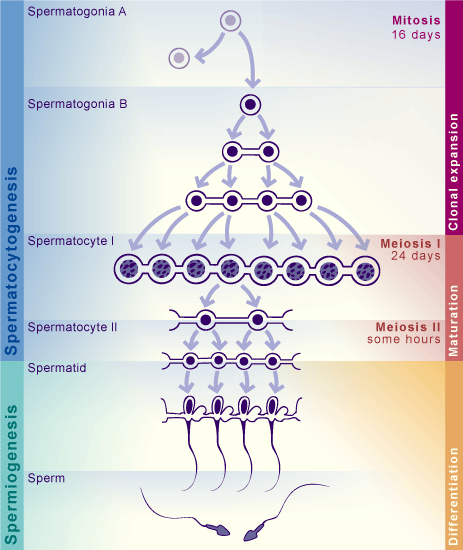

# Cell clustering and Differential Expression (DE)

!!! note "Section Overview"

    &#128368; **Time Estimation:** 45-60 minutes

    &#128172; **Learning Objectives:**    

    1. Perform unsupervised clustering on the dataset
    2. Identify potential cell clusters by visualizing marker genes on the UMAP plot
    3. Understanding and applying differential gene expression analysis to verify cluster identities
    4. Performing an analysis of subclusters in the dataset

Spermatogenesis goes through different stages, starting from *SpermatogoniaA* cells, going into clonal expansion while keeping cells connected through cytoplasmic bridges (*SpermatogoniaB*), and then continuing with the meiotic process (*Spermatocites I and II*). Finally, cells become *Round spermatids*, which then elongate to become *Elongated spermatids and sperm*.



Detecting those cell types is essential to answer biological questions such as: - which genes are most expressed for each cell type (beyond well known ones)? - in which proportion is every cell type present? - are there unknown cell types that I can identify?

## Setup

``` r
library(tidyverse)
library(patchwork)
library(Seurat)
library(SeuratDisk)

LoadH5Seurat("../../Data/notebooks_data/sample_123.filt.norm.red.h5Seurat")
```

## Cell clustering

Seurat applies a graph-based clustering approach, building upon initial strategies in ([Macosko *et al*](http://www.cell.com/abstract/S0092-8674(15)00549-8)). Importantly, the *distance metric* which drives the clustering analysis (based on previously identified PCs) remains the same. However, Seurat’s approach to partitioning the cellular distance matrix into clusters is heavily inspired by graph-based clustering approaches to scRNA-seq data [\[SNN-Cliq, Xu and Su, Bioinformatics, 2015\]](http://bioinformatics.oxfordjournals.org/content/early/2015/02/10/bioinformatics.btv088.abstract) and CyTOF data [\[PhenoGraph, Levine *et al*., Cell, 2015\]](http://www.ncbi.nlm.nih.gov/pubmed/26095251). Briefly, these methods embed cells in a graph structure - for example a K-nearest neighbor (KNN) graph, with edges drawn between cells with similar feature expression patterns, and then attempt to partition this graph into highly interconnected ‘quasi-cliques’ or ‘communities’.

As in PhenoGraph, Seurat first constructs a KNN graph based on the euclidean distance in PCA space, and refine the edge weights between any two cells based on the shared overlap in their local neighborhoods (Jaccard similarity). This step is performed using the `FindNeighbors()` function, and takes as input the previously defined dimensionality of the dataset (first 10 PCs).

To cluster the cells, we next apply modularity optimization techniques such as the Louvain algorithm (default) or SLM [\[SLM, Blondel *et al*., Journal of Statistical Mechanics\]](http://dx.doi.org/10.1088/1742-5468/2008/10/P10008), to iteratively group cells together, with the goal of optimizing the standard modularity function. The `FindClusters()` function implements this procedure, and contains a resolution parameter that sets the ‘granularity’ of the downstream clustering, with increased values leading to a greater number of clusters.

It is recommended to set this parameter between 0.4-1.2, as it typically returns good results for single-cell datasets of around 3K cells.

``` r
sample.combined.sct <- FindNeighbors(sample.combined.sct, dims = 1:10)
sample.combined.sct <- FindClusters(sample.combined.sct, resolution = 0.5)
```

The clusters can be found using the `Idents()` function or in the metadata of the assay.

``` r
head(Idents(sample.combined.sct), 5)
head(sample.combined.sct@meta.data)
head(sample.combined.sct$seurat.clusters)
```

### Visualization

Finally we can visualize our clusters in the data using the `DimPlot()` function.

``` r
DimPlot(sample.combined.sct, reduction = 'umap')
```

!!! question "Exercise"

    Play with the `resolution` argument of FindClusters. How is the parameter related to the number of clusters identified?
    *Note:* The new clusters are saved in a new column of the metadata dataframe.


    ```r
    sample.combined.sct <- FindClusters(sample.combined.sct, resolution = ??)
    DimPlot(sample.combined.sct, reduction = 'umap')
    ```

## Finding differentially expressed markers

Seurat can help you find markers that define clusters via differential expression using the `FindAllMarkers()` function. By default, it identifies positive and negative markers of a single cluster (specified in `ident.1`), compared to all other cells. `FindAllMarkers()` automates this process for all clusters, but you can also test groups of clusters vs. each other, or against all cells using the `FindMarkers()` function. `FindMarkers()` function is specially useful to identify specific markers for subclusters of cells.

``` r
# Find all markers
all.markers <- FindAllMarkers(pbmc)

# A cluster vs another
cluster0v1.markers <- FindMarkers(pbmc, ident.1 = 0, ident.2 = c(1))

# A cluster vs other clusters
cluster0v1_2.markers <- FindMarkers(pbmc, ident.1 = 0, ident.2 = c(1,2))
```

The results dataframe looks like this:

``` r
head(all.markers)
```

- p_val : p_val of the test used for differential expression (unadjusted)
- avg_log2FC : log fold-change of the average expression between the two groups. Positive values indicate that the feature is more highly expressed in the first group.
- pct.1 : The percentage of cells where the feature is detected in the first group
- pct.2 : The percentage of cells where the feature is detected in the second group
- p_val_adj : Adjusted p-value, based on Bonferroni correction using all features in the dataset.
- gene : feature names will appear as row names using `FindMarkers()`, or as a column with `FindAllMarkers()`
- cluster : using the `FindAllMarkers()` will return which cluster had each marker

The `min.pct` argument requires a feature to be detected at a minimum percentage in either of the two groups of cells, and the `logfc.threshold` argument requires a feature to be differentially expressed (on average) by some amount between the two groups. You can set both of these to 0, but with a dramatic increase in time - since this will test a large number of features that are unlikely to be highly discriminatory. As another option to speed up these computations, `max.cells.per.ident` can be set. This will downsample each identity class to have no more cells than whatever this is set to. While there is generally going to be a loss in power, the speed increases can be significant and the most highly differentially expressed features will likely still rise to the top.

``` r
# find markers for every cluster compared to all remaining cells, report only the positive ones with a LFC above 0.25 and at least 25% of cells express that feature.
all.markers <- FindAllMarkers(pbmc3k, only.pos = TRUE, min.pct = 0.25, logfc.threshold = 0.25)
all.markers %>% group_by(cluster) %>% slice_max(n = 2, order_by = avg_log2FC) # Show top 2 markers for each cluster
```

You can easily save your marker dataframes using `write.table()`

``` r
write.table(x = all.markers, file = "../../Data/results/all_markers.tsv", col.names = TRUE, row.names = FALSE, sep = "\t", quote = FALSE)
```

### Alternate testing for differential expression

As a default, Seurat performs differential expression based on the non-parametric Wilcoxon rank sum test. Nontheless, the following differential expression tests are currently supported:

- "wilcox" : Wilcoxon rank sum test (default)
- "bimod" : Likelihood-ratio test for single cell feature expression, (McDavid et al., Bioinformatics, 2013)
- "roc" : Standard AUC classifier
- "t" : Student’s t-test
- "poisson" : Likelihood ratio test assuming an underlying negative binomial distribution. Use only for UMI-based datasets
- "negbinom" : Likelihood ratio test assuming an underlying negative binomial distribution. Use only for UMI-based datasets
- "LR" : Uses a logistic regression framework to determine differentially expressed genes. Constructs a logistic regression model predicting group membership based on each feature individually and compares this to a null model with a likelihood ratio test.
- "MAST" : GLM-framework that treates cellular detection rate as a covariate (Finak et al, Genome Biology, 2015) (Installation instructions)
- "DESeq2" : DE based on a model using the negative binomial distribution (Love et al, Genome Biology, 2014) (Installation instructions)

For MAST and DESeq2, please ensure that these packages are installed separately in order to use them as part of Seurat. Once installed, use the `test.use` parameter can be used to specify which DE test to use. For example, the ROC test returns the ‘classification power’ for any individual marker (ranging from 0 - random, to 1 - perfect).

``` r
cluster0.markers <- FindMarkers(pbmc, ident.1 = 0, logfc.threshold = 0.25, test.use = "roc", only.pos = TRUE)
```

### Visualization of marker genes

Seurat includes several tools for visualizing marker expression. `VlnPlot()` (shows expression probability distributions across clusters), and `FeaturePlot()` (visualizes feature expression on a UMAP or PCA plot) are some of the most commonly used visualizations. It is also suggested that you exploring `RidgePlot()`, and `DotPlot()` as additional methods to view your dataset.

``` r
# You can visualize several markers at the same time using the features argument
VlnPlot(pbmc3k, features = c("ID4", "MKI67","CD14"))
FeaturePlot(pbmc3k, features = c("ID4", "MKI67","CD14"))
RidgePlot(pbmc3k, features = c("ID4", "MKI67","CD14"))
DotPlot(object = pbmc3k, features = c("ID4", "MKI67","CD14"))
```

`DoHeatmap()` generates an expression heatmap for given cells and features. In this case, we are plotting the top 20 markers (or all markers if less than 20) for each cluster.

``` r
all.markers %>%
    group_by(cluster) %>%
    top_n(n = 10, wt = avg_log2FC) -> top10
DoHeatmap(sample.combined.sct, features = top10$gene) + NoLegend()
```

### Cluster annotation through known markers

We try to identify clusters of cells by looking at the expression of relevant marker genes. This requires a previous biological knowledge of those cell types, such that we can input the markers. Below, we define a list of markers, where for each cell type we define a list of markers. Then we will plot every list of markers on the UMAP plot:

``` r
markers <- list() #make an empty dictionary
### SPERMATOCYTOGENESIS
markers['SpermatogoniaA'] = c('ID4')
markers['SpermatogoniaB'] = c('MKI67','DMRT1','STRA8')
markers['SpermatocytesI'] = c('MEIOB','SYCP1','TEX101')
markers['SpermatocytesII'] = c('PIWIL1','SPATA16','CLGN')
### SPERMIOGENESIS
markers['Round.Spt'] = c('SPATA9','SPAM1') #Round spermatids
markers['Elong.Spt'] = c('PRM1','PRM2','PRM3','AKAP4') #Elongated spermatids
### SOMATIC CELLS
markers['Sertoli'] = c('VIM','CTSL')
markers['Macroph'] = c('CD14')
markers['Leydig'] = c('CFD')
markers['Endothelial'] = c('CD34')
markers['Myoid'] = c('ACTA2')

# remove markers missing in the dataset

for (i in names(markers)){
  markers[i] = intersect(markers[i], rownames(sample.combined.sct))
}
```

``` r
FeaturePlot(pbmc3k, features = markers['SpermatogoniaA'])
```

``` r
FeaturePlot(pbmc3k, features = markers['SpermatogoniaB'])
```

``` r
FeaturePlot(pbmc3k, features = markers['SpermatocytesI'])
```

``` r
FeaturePlot(pbmc3k, features = markers['SpermatocytesII'])
```

``` r
FeaturePlot(pbmc3k, features = markers['Round.Spt'])
```

``` r
FeaturePlot(pbmc3k, features = markers['Elong.Spt'])
```

Sertoli are often not possible to identify. They are big in size, meaning they are often not isolated successfully. Many of their markers are in common with other somatic cells. Also, their function as nurse cells for germ cells of the testis means that their marker genes are also expressed. We can see that CTSL is expressed in some germ cells, but not in other clusters, while VIM is expressed in a likely somatic cluster (but it is common to other somatic cell types).

``` r
FeaturePlot(pbmc3k, features = markers['Sertoli'])
```

Macrophage cells seem to be absent.

``` r
FeaturePlot(pbmc3k, features = markers['Macroph'])
```

Leydig cells are likely to be missing as well.

``` r
FeaturePlot(pbmc3k, features = markers['Leydig'])
```

There is a little endothelial cluster.

``` r
FeaturePlot(pbmc3k, features = markers['Endothelial'])
```

And also a myoid cluster.

``` r
FeaturePlot(pbmc3k, features = markers['Myoid'])
```

### Calculating cell scores

Using the `AddModuleScore()` function, you can use the previous list of different cell markers to give a "score" to each cell, instead of exploring every gene from your list of markers. This is extremely useful when you want to assign cell types if you have biological knowledge (markers). Nonetheless, you will have to make sure the list of markers will be specific to those clusters, otherwise there is a chance you cannot properly identify clusters using this list.

``` r
for (i in names(markers)){
  pbmc3k <- AddModuleScore(pbmc3k, features = markers[i], name = i)
}
```

We can visualize the scores either in a `FeaturePlot()` or a `VlnPlot()`. For example, let’s take a look at the SpermatogoniaB cell score:

``` r
FeaturePlot(pbmc3k, reduction = "umap", features = "SpermatogoniaB1")
VlnPlot(pbmc3k, features = "SpermatogoniaB1", group.by = "seurat_clusters")
```

It looks pretty good! However, lets check the SpermatogoniaA

``` r
FeaturePlot(pbmc3k, reduction = "umap", features = "SpermatogoniaA1")
VlnPlot(pbmc3k, features = "SpermatogoniaA1", group.by = "seurat_clusters")
```

As we can see, the set of features used to calculate module scores may not be specific enough to accurately depict a cell type. Some clusters seem to have just enough expression of those genes to have positive scores, and single cell dropouts makes it very difficult to score a cell based only on a single gene. However, it works very well when selecting marker genes from the `FindMarkers()` function.

### Assigning names to clusters

Now that we know what kind of cell types our clusters are, we can name them properly. Write the names in the list `new_names`. You should be able to **give a name for each cell type**. Below is an example, but the names are not in the right position. If there is more than one cluster with same cell type, just write the name followed by a dot `.` and a number. For example, by writing for example `.1` and `.2` at the end of the names. We will remove the numbers afterwords.

``` r
new_names = c(
    '0'='SpermatocitesII',
    '1'='SpermatogoniaA',
    '2'='RoundSpermatids',
    '3'='RoundSpermatids',
    '4'='RoundSpermatids',
    '5'='ElongSpermatids',
    '6'='SpermatocitesI',
    '7'='RoundSpermatids',
    '8'='ElongSpermatids',
    '9'='SpermatogoniaB',
    '10'='Somatic',
    '11'='SpermatocitesII'
)
```

Now we apply the new names and save them in a new meta.data variable called "cluster_names":

``` r
sample.combined.sct$cluster_names <- recode(Idents(sample.combined.sct), !!!new_names)

Idents(sample.combined.sct) <- "cluster_names"
```

Finally, we visualize the new cluster names!

``` r
DimPlot(sample.combined.sct, reduction = "umap", label = TRUE)
DoHeatmap(sample.combined.sct, features = unlist(markers))
```

## Selecting and subclustering

If we suspect that a cluster might be composed of an heterogeneous population of cells, we can subset that group of cells and find subclusters of cells. This is the case for the cell types found in late spermatogonia and spermatocites.

### Subsetting the data

We can subset our Seurat object using the `subset()` function and selecting our clusters of interest from the `idents` argument. Note that you have to have selected our "cluster_names" as your `Ident()`!

``` r
# Clusters of interest and their markers
clusters <- c('SpermatogoniaB','SpermatocitesI','SpermatocitesII')
sample_subset <- subset(x = sample.combined.sct, idents = clusters)

markers['Leptotene'] = c('SYCE2','SCML1')
markers['Zygotene'] = c('LY6K', 'SYCP1')
markers['Pachytene'] = c('PIWIL1','CCDC112')
markers['Diplotene'] = c('OVOL2','CCNA1', 'CDK1','AURKA')
```

Let’s look at the marker plots of these specific clusters:

``` r
FeaturePlot(sample_subset, features = markers['Leptotene'] )
```

``` r
FeaturePlot(sample_subset, features = markers['Zygotene'] )
```

``` r
FeaturePlot(sample_subset, features = markers['Pachytene'] )
```

``` r
FeaturePlot(sample_subset, features = markers['Diplotene'] )
```

### Recalculate clusters

Now we can recalculate our neighbours and the clusters. What should be the `resolution` argument?

``` r
sample_subset <- FindNeighbors(sample_subset)
sample_subset <- FindClusters(sample_subset, resolution = 0.4)
```

And we can visualize our subclustering using `DimPlot()`:

``` r
DimPlot(sample_subset, reduction = "umap")
```

It would be more convenient to rename our clusters. We should be able to do it using the same code snippet as before!

``` r
new_names = c(
    '0'='SpermatogoniaB',
    '1'='Zygotene',
    '2'='Diplotene',
    '3'='Diplotene',
    '4'='Diplotene',
    '5'='Leptotene',
    '6'='Pachytene',
    '7'='Pachytene',
    '8'='Diplotene')

sample_subset$cluster_names <- recode(Idents(sample_subset), !!!new_names)
```

### Differential expression

We can find specific differences between the subclusters found in here:

``` r
subset_markers <- FindAllMarkers(sample_subset, logfc.threshold = 0.25, only.pos = TRUE)

subset_markers %>%
group_by(cluster) %>%
    top_n(n = 10, wt = avg_log2FC) -> subset_top10

head(subset_top10)
```

We should be able to find at least some of the markers used in the plots. However, it can be that those do not appear because there are many other coexpressed genes with high expression values.

``` r
DoHeatmap(sample_subset, features = subset_top10$gene) + NoLegend()
```

We can find some of the marker genes. For example `SCML1` for leptotene cells, `SYCP1` and `LY6K` for zygotene, `CCDC112` and `PIWIL1` for pachitene, `CCNA1` and `AURKA` for zygotene.

``` r
DoHeatmap(sample_subset, features = unlist(markers[c("Leptotene","Zygotene","Pachytene","Diplotene")])) + NoLegend()
```

### Reintegrating the subclusters

Since we have created a subset of the original data, how can we integrate the new subclusters back into the dataset? We will need to do some data wrangling

First we create a new metadata variable in the original Seurat object.

``` r
sample.combined.sct$subclusters <- sample.combined.sct$cluster_names
```

The new subclusters are found in the subset metadata. We only need to get the cell names and change the original dataset accordingly.

``` r
subset_cells <- rownames(sample_subset@meta.data)
sample.combined.sct$subclusters<- sample_subset$seurat_clusters
```

We can visualize the before and after very easily now:

``` r
p1 <- DimPlot(sample.combined.sct, reduction = "umap", group.by = "cluster_names", label = T)
p2 <- DimPlot(sample.combined.sct, reduction = "umap", group.by = "subclusters", label = T)

p1 + p2
```

### Cluster correlations

An useful method we can use to check the quality of our clusters is to compute cluster correlations. Unfortunately, Seurat does not provide a straight forward method, but it is fairly simple to calculate. First we make use of the `AverageExpression()` function, which, as the name implies, will compute the average expression of the groups of cells (clusters or other types of groups).

``` r
av.exp <- AverageExpression(sample.combined.sct, assay = "SCT", slot = "data")

head(av.exp)
```

Then we calculate the correlations between the columns (clusters) and plot it using the `pheatmap()` package.

``` r
pheatmap(cor(av.exp), treeheight_col = 0, breaks = seq(-1,1,length.out = 100), display_numbers = T)
```

## Save our clustered data

``` r
SaveH5Seurat(sample.combined.sct, filename = "../../Data/notebooks_data/sample_123.filt.norm.red.clust.h5Seurat")
```

## Wrapping up

We have been showing how to identify potential cell clusters. In this dataset, cells change from one type to another in a continuous process, so such a hard clustering may not completely reflect biological reality. However, it is a good approximation, as it is illustrated by the differentially expressed genes that we checked in each cluster.

We performed differential expression and what are the useful values that we get from it (p-value of the test, magnitude of the gene expression compared to all other clusters). Finally, we subsetted the data and subject it to a more fine grained cell identification.
