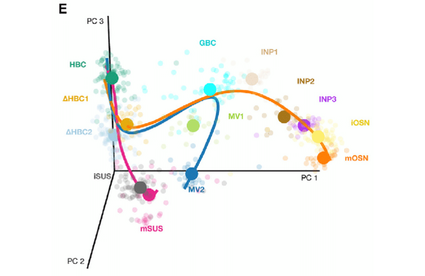

# Pseudotimes and cell fates

!!! note "Section Overview"

    &#128368; **Time Estimation:** 45 minutes  

    &#128172; **Learning Objectives:**    

    1. Understand and determine the pseudotimes on a single cell dataset
    2. Infer cell fates and distinguish between differentiation stages or actual final developmental stages
    3. Compare gene expressions along differentiation
    4. Cluster genes with similar gene expression

While clustering is an useful type of analysis to try giving a structure to the development of cells towards their final stage (spermatozoa), it does not give an understanding of how the development "stretches" from start to end. For example, a cluster can have many cells and look "big" on UMAP, but actually its variability in terms of gene expressions could be low. Also, a developmental process can branches towards different ends (cell fates) or developmental checkpoints (e.g. stages where damaged cells express specific genes for apoptosis/cell death). Pseudotime and cell fates analysis can be used to hgihlight exactly those processes.

- **Pseudotimes** assigns to each cell the value of a timeline, starting from 0 for the cells at the beginning of the development. This value is purely a reference for ordering the cells development, but pseudotimes at specific stages can be assigned to real times, using previous biological knowledge.
- **Cell fates analysis** looks at the PCA projection of the data and the pseudotime of each data point on the PCA. From this, it tries to create a tree connecting the cells, so that the end branches of the tree are different end points or stages of the developmental process.



*Figure: cell fates tree on a 3D pca plot. Circles represent the middle point of each cluster. From Perredaeau et al. (2017)*

## Setup

``` r
library(Seurat)
library(SeuratDisk)
library(tidyverse)
library(slingshot)

LoadH5Seurat("../../Data/notebooks_data/sample_123.filt.norm.red.clust.h5Seurat")
```

## Pseudotime

We will use the package [Slignshot](https://bioconductor.org/packages/release/bioc/vignettes/slingshot/inst/doc/vignette.html). Slingshot was designed to model developmental trajectories in single-cell RNA sequencing data and serve as a component in an analysis pipeline after dimensionality reduction and clustering.

``` r
sample.combined.SCE <- as.SingleCellExperiment(sample.combined.sct)
sde <- slingshot(sample.combined.SCE, reducedDim = 'PCA')
```

The using the `slingshot` package it is possible to plot our components and the calculated trajectory. Unfortunately, it does not work with ggplot.

``` r
cols <- colorRampPalette(viridis::viridis(3))
cols <- cols(50)[cut(sde$slingPseudotime_1, breaks=50)]
plot(reducedDim(sample.combined.SCE, "PCA"), pch=16, col = cols) # sample.combined.SCE contains, PC1 and PC2, and colored by pseudotime
lines(slingshot::SlingshotDataSet(sde), lwd = 2) # here we plot the trajectory
```

It is possible to create a `FeaturePlot()` with both pseudotime and the trajectory by extracting the information from our `slingshot` object and add it to our `Seurat` object, but it is a bit inconvenient. First, pseudotime can be extracted with the function `slingPseudotime()`. The trajectory curves are stored inside the slingshot object `sde`; in this case, it is easier since there is only one trajectory.

``` r
sample.combined.sct$pseudotime <- slingPseudotime(sde)
trajectory <- data.frame(SlingshotDataSet(sde)@curves[["Lineage1"]][["s"]])
head(trajectory)
```

Now we can use Seurat functions to plot the pseudotime and the calculated trajectory!

``` r
FeaturePlot(sample.combined.sct, features = "pseudotime", reduction = "pca") + scale_color_viridis_c() + geom_path(data = trajectory, aes(x = PC_1, y = PC_2))
```

``` r
DimPlot(sample.combined.sct, group.by = "Cell_type", reduction = "pca")
```

We can create a plot that sorts our cells by pseudotime and check that it corresponds to their cell type:

``` r
sample.combined.SCE$pseudotime <- as.numeric(slingPseudotime(sde))
ggplot(as.data.frame(colData(sample.combined.SCE)), aes(x = pseudotime,
                                             y = Cell_type,
                                             colour = Cell_type)) +
  ggbeeswarm::geom_quasirandom(groupOnX = FALSE) +
  theme_classic() +
  xlab("Slingshot pseudotime") + ylab("Timepoint") +
  ggtitle("Cells ordered by Slingshot pseudotime")
```

## Wrapping up

This notebook shows how to do pseudotimes analysis and exploring cell fates and gene expressions. We have seen how to distinguish between an actual differentiation branch and a differentiation stage. Basically, all cells before (i.e. earlier in pseudotime) a differentiation stage will be associated to such stage with high probability, because they must go through that developmental stage. Finding a developmental stage around meiosis in spermatogenic samples is a common result across single cell datasets of many species, such as humans, primates and mice. Using the `palantir` software, we can look at differences between gene expressions for different fates, and cluster together genes of interest for further analysis.
