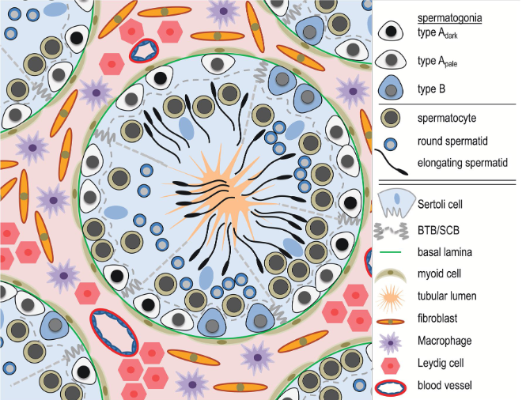

<!--
# Put above to hide navigation (left), toc (right) or footer (bottom)

hide:
  - navigation 
  - toc
  - footer 

# You should hide the navigation if there are no subsections
# You should hide the Table of Contents if there are no important titles
-->

Introduction to single cell RNAseq sequencing data analysis

**Updated:** 28/02/2023
**(Page under construction - course not finalized)**

This course is organized as the analysis project of a dataset with cells from human testis representing the spermatogenesis process. We will also make a comparative analysis against a dataset from a person affected by azoospermia (missing or faulty production of spermatozoa). You will learn to use the tools for integrating and analyzing multiple datasets in both `python` and `R` with the use of interactive coding on `Rstudio` or `Jupyter Notebooks`. 

 

<!-- AUTHORS -->
<!-- Format: [author name](link to author page){ .md-button } -->
<h4>Authors</h4>

[José Alejandro Romero Herrera](https://www.linkedin.com/in/jose-alejandro-romero-herrera/){ .md-button }
[Samuele Soraggi](https://www.linkedin.com/in/samuelesoraggi/){ .md-button }

<!-- OVERVIEW OF COURSE -->
!!! abstract "Overview"
    
    &#128172; **Syllabus:**    
    1. Data explanation
    2. Read normalization and QC (python: scanpy | R: Seurat)
    3. Exploratory analysis and clustering (python: scanpy | R: Seurat)
    4. Differential Expression Analysis (python: scanpy | R: Seurat)
    5. Pseudotime and trajectories (python: scanpy/Palantir | R: Seurat/Slingshot)
    6. Functional Analysis (python: scanpy/gseapy) 

    &#128368; **Total Time Estimation:** 6 hours  

    &#128193; **Supporting Materials:**  

    &#128203; **License:** [Tutorial Content is licensed under Creative Commons Attribution 4.0 International License](https://creativecommons.org/licenses/by/4.0/)

!!! warning "Course Requirements"
    
    - Knowledge of R, Rstudio and Rmarkdown or Python and Jupyter Notebooks.
    - Basic knowledge of scRNAseq technology
    - Basic knowledge of data science and statistics such as PCA, clustering and statistical testing

## Biological background and motivation

The testis is a complex organ composed of multiple cell types: germ cells at different stages of maturation and several somatic cell types supporting testicular structure and spermatogen-esis; Sertoli cells, peritubular cells, Leydig cells and other interstitial cells, as outlined in the figure below.

Technological developments have recently made it possible to perform single-cell RNA sequencing (scRNAseq) of all cell types in a tissue. Understanding how scRNAseq data is processed and how to interpret the data is crucial for our ability to draw correct biological conclusions.

In this introduction we will preprocess and integrate multiple datasets together and perform an analysis to detect cell types, developmental stages, genes dominating in the various cell types, in a way that the spermatogenic process can be framed and characterized as an output of this course.

Infertility is a growing problem, especially in the Western world, where approximately 10–15% of couples are infertile. In line with this, we have observed a tremendous increase in the use of assisted reproductive techniques (ART) and espe-cially Intracytoplasmic Sperm Injection.  In about half of the infertile couples, the cause involves a male-factor (Agarwal et al. 2015; Barratt et al. 2017). One of the most severe forms of male infertility is azoo-spermia (from Greek azo - meaning “without life”) where no spermatozoa can be detected in the ejaculate, which ren-ders biological fatherhood difficult. Azoospermia is found in approximately 10–15% of infertile men (Jarow et al. 1989; Olesen et al. 2017) and the aetiology is thought to be primarily genetic.  

As the last step of this course, we will use a dataset of azoospermic cells to make a comparative analysis against the healthy cells. We will try to find which developmental processes are more highlighted in only one of the two datasets, and see which other differences characterize the azoospermic single cell data.

### Acknowledgements

- [Center for Health Data Science](https://heads.ku.dk/), University of Copenhagen.