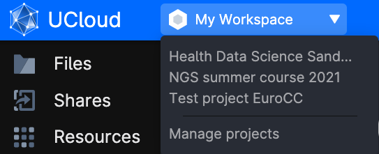
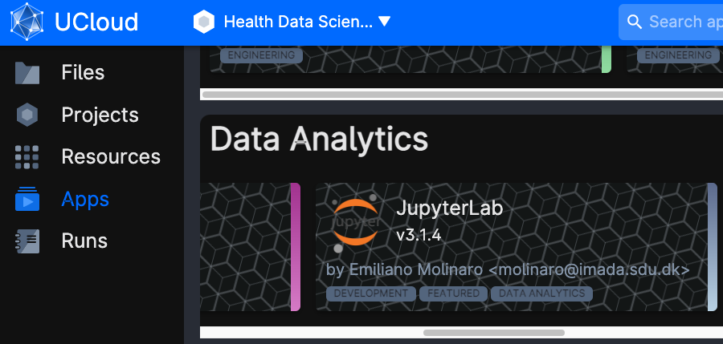
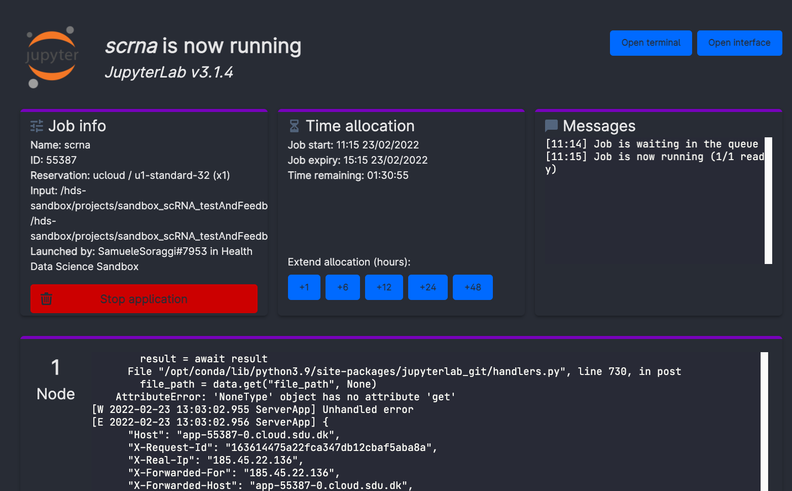

# Setup for coding

In what follows you have the setup guide for the possible hardware where you are running the course material.

## For Ucloud users

Access to [Ucloud](https://cloud.sdu.dk) with your account and choose the project `Health data science sandbox` where you have been invited.

Click on `Apps` on the left-side menu, and look for the application `JupyterLab`.

Once the app is chosen, click on `Run application` on the right-hand side of the screen. You will be met with a series of possible parameters to choose. You have to assign:

- job name: simply any name given to the app execution
- hours: how long you are using the app. You can choose as many hours as the course session lasts. Or just a couple of hours to do some exercises. You can always add extra time while using the app, or run it again with the same settings (they will be saved under the name you chose as `job name`)
- Machine type: it is sufficient to choose a machine with 8 vCPUs or 16 vCPUs. The notebooks number three and six are however quite heavy, and we suggest to use 16 or 32 vCPUs for those.
- Dependencies: commands that will run automatically when starting the app. Choose the same file as in the picture (`projects/sandbox_scRNA_testAndFeedback/scRNAseq_course/Environments/Python/Ucloud_conda.sh`), it will get all the packages up and running.
- Select folders to use: makes specific folders usable by the app. Choose the same folder as in the picture (`projects/sandbox_scRNA_testAndFeedback`), it contains the data.

You are ready to run the app by clicking on the button on the right column of the screen (`submit`). Now, wait some time until the screen will look like in the figure below. It usually takes a few minutes for everything to be ready and installed. You can always come back to this screen from the left menu `Runs` on ucloud, so that you can add extra time or stop the app if you will not use it.

Now, click on `open interface` on the top right-hand side of the screen. You will start jupyter lab through your browser! On the left side of jupyter lab, where you see the file explorer, make a right click and create a folder with your name, and open it. Then, click on the `version control` button (the squared button on the very left of the screen). You will get a message: choose `Clone a repository`, and insert the following link: `https://github.com/hds-sandbox/scRNASeq_course.git`.

Now, open the folder scRNAseq_course. You will find the python notebooks in the folder `Notebooks/Python`. They will match the notebooks illustrated as guide in this webpage. You can read each notebook here before you run it in jupyterlab. Every time you open a notebook, go on the menu `kernel --> change kernel`, and choose `Python (scRNA)`.